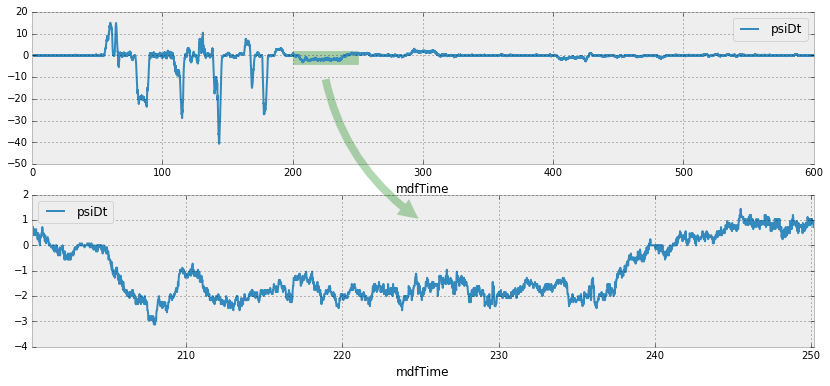

+++
date = '2016-01-23T12:00:53+01:00'
draft = false
slug = "matplotlib-draw-between-subplots"
title = "Matplotlib: draw between subplots"
categories = ["python", "code"]
tags = ["featured", "python", "matplotlib", "pandas", "code"]
keywords = ["matplotlib", "subplots", "figure", "python", "pandas"]
description = "Draw between different subplots on a single Matplotlib figure"
image = "images/posts/2016-01-23-matplotlib-draw-between-subplots/header.webp"
author = "Cilyan Olowen"
+++

Last week, I was preparing a data analysis report using
[Jupyter](http://jupyter.org/), [Pandas](http://pandas.pydata.org/) and
[Matplotlib](http://matplotlib.org/) (to only quote a few bricks of this
wonderful framework). One of the figures had two subplots, the second being an
enlargement of a region of the first. To make it obvious, and at the same time
show the old MATLAB Fanclub how so 90 they were, I decided to put an arrow from
the first to the second subplot.

<div class="text-center rounded-lg bg-theme-light/30 my-3">



</div>

Alas, from this simple idea started a three hours long research on the Internet,
many trials and errors, even a bunch of crashes, and I was close to surrender
against the technology of the last century... No way!

## Artists and Tranformations

_If you only need to show off, skip this section._ I'm just going to explain
roughly what's under the hood. Figures, Axes, Axis, what are they? I cannot
think of a better explanation than the
[Matplotlib's Artist Tutorial](http://matplotlib.org/users/artists.html), but
I'll try to summarize it. In Matplotlib, you draw on a _Canvas_ using a
_Renderer_. The objects that know how to use a renderer to draw on the canvas
are called Artists.

**_There are two types of Artists: primitives and containers. The primitives
represent the standard graphical objects we want to paint onto our canvas:
Line2D, Rectangle, Text, AxesImage, etc., and the containers are places to put
them on (Axis, Axes and Figure)._**

From this, we deduce that we need to create a _primitive_, namely a `Patch`, and
more exactly in my case a `FancyArrowPatch`, and add it to the figure. Easy.

There is another aspect to take into account. As we are adding a patch to the
figure, it is normal to expect that it will be drawn using the figure's
coordinates. This is not very easy when it comes to properly place the arrow. To
solve this, we need to have a look at how transformations work. There again,
there is a very nice
[Transformations Tutorial](http://matplotlib.org/users/transforms_tutorial.html),
and it will be hard to explain better. When dealing with coordinates in
Matplotlib, you need to take into account which coordinates system they apply
to. There are 4 coordinates systems:

| Coordinate | Transformation Object | Description                                                                                                                                                                                                                                                                                                                                                                                                        |
| ---------- | --------------------- | ------------------------------------------------------------------------------------------------------------------------------------------------------------------------------------------------------------------------------------------------------------------------------------------------------------------------------------------------------------------------------------------------------------------ |
| `data`     | `ax.transData`        | The userland data coordinate system, controlled by the xlim and ylim                                                                                                                                                                                                                                                                                                                                               |
| `axes`     | `ax.transAxes`        | The coordinate system of the [`Axes`](http://matplotlib.org/api/axes_api.html#matplotlib.axes.Axes "matplotlib.axes.Axes"); (0,0) is bottom left of the axes, and (1,1) is top right of the axes.                                                                                                                                                                                                                  |
| `figure`   | `fig.transFigure`     | The coordinate system of the [`Figure`](http://matplotlib.org/api/figure_api.html#matplotlib.figure.Figure "matplotlib.figure.Figure"); (0,0) is bottom left of the figure, and (1,1) is top right of the figure.                                                                                                                                                                                                  |
| `display`  | `None`                | This is the pixel coordinate system of the display; (0,0) is the bottom left of the display, and (width, height) is the top right of the display in pixels. Alternatively, the identity transform ([`matplotlib.transforms.IdentityTransform()`](http://matplotlib.org/devel/transformations.html#matplotlib.transforms.IdentityTransform "matplotlib.transforms.IdentityTransform")) may be used instead of None. |

The reference system is the `display`, and transformation objects describe how
to map coordinates back to this reference system. We know where we would
position the arrow according to the plotted data, i.e. its coordinates in the
data systems, but we have no idea where this could maps onto the whole figure.
If we apply a transformation using the data system's transformation object, we
obtain the coordinates in the display system. One step. The next is simply to
apply an inverted transformation using the figure system's transformation object
to convert again from the display system to the figure system.

One last thing to take care of, is to properly specify the coordinate system we
use when creating the patch through the `transform` parameter.

## Show me the Code

Okay, get your data ready, setup the plot! In the below example, I use a Pandas
DataFrame, but this would work the same with NumPy arrays.

```python
import matplotlib.pyplot as plt
import matplotlib.patches

fig, axes = plt.subplots(2)
# Show the full measurement for comparison on axis 0
testdata.plot(ax=axes[0], x="mdfTime", y="psiDt")
# Place a little rectangle to mark the area of the enlargement
axes[0].add_patch(matplotlib.patches.Rectangle((200., -4.), 50., 6., transform=axes[0].transData, alpha=0.3, color="g"))
# Enlarged measurement on axis 1
testdata[int(200./0.02):int(250./0.02)].plot(ax=axes[1], x="mdfTime", y="psiDt")
```

And finally, the really relevant piece of code:

```python
# Create the arrow
# 1. Get transformation operators for axis and figure
ax0tr = axes[0].transData # Axis 0 -> Display
ax1tr = axes[1].transData # Axis 1 -> Display
figtr = fig.transFigure.inverted() # Display -> Figure
# 2. Transform arrow start point from axis 0 to figure coordinates
ptB = figtr.transform(ax0tr.transform((225., -10.)))
# 3. Transform arrow end point from axis 1 to figure coordinates
ptE = figtr.transform(ax1tr.transform((225., 1.)))
# 4. Create the patch
arrow = matplotlib.patches.FancyArrowPatch(
    ptB, ptE, transform=fig.transFigure,  # Place arrow in figure coord system
    fc = "g", connectionstyle="arc3,rad=0.2", arrowstyle='simple', alpha = 0.3,
    mutation_scale = 40.
)
# 5. Add patch to list of objects to draw onto the figure
fig.patches.append(arrow)
```

<div class="text-center rounded-lg my-3 bg-theme-light/30">


</div>

If you are dealing with lines, the process is the same, but you need to append
your crafted object to the `lines` property of the figure instead of `patches`.
Have a look at this
[StackOverflow question](http://stackoverflow.com/questions/17543359/drawing-lines-between-two-plots-in-matplotlib/17560223#17560223).
