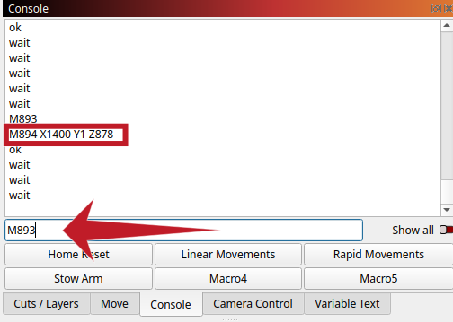

+++
author = 'Tehoor Marjan'
categories = ['creation']
date = '2025-01-21T13:31:36+01:00'
description = 'A hands-on guide to setting up and using the Rotrics DexArm with LightBurn software for laser engraving and cutting.'
draft = false
image = 'images/posts/2025-01-21-how-to-set-up-and-use-the-rotrics-dexarm-with-lightburn/header.webp'
keywords = ['dexarm', 'rotrics', 'lightburn', 'laser-cutting', 'robotic', 'diy']
math = true
slug = 'how-to-set-up-and-use-the-rotrics-dexarm-with-lightburn'
tags = ['creation', 'dexarm', 'laser-cutting', 'lightburn']
title = 'How to Set Up and Use the Rotrics DexArm with LightBurn'
+++

The [Rotrics DexArm][dexarm] is a quirky and intriguing addition to the world of
3D printing and laser cutting. Unlike traditional laser cutters, it’s a 4-axis
desktop robotic arm with modular versatility, allowing it to switch seamlessly
between roles like laser engraving, 3D printing, plotting, and even gripping
objects.

This flexibility comes with its own challenges, particularly when integrating it
with software like [LightBurn][lightburn], which is primarily designed for
conventional setups.

<!-- more -->

Unfortunately, if you don't already own one, I can't recommend buying it.
_Rotrics_ abandoned its product a while ago, leaving only the sales running. The
[Rotrics Studio][studio] software is notoriously buggy and feature-poor. But if
you're one of the lucky (or unlucky) DexArm owners, don’t worry—there’s hope!

Today, I'll guide you through setting up the DexArm on [LightBurn][lightburn], a
powerful software for laser cutting and engraving. This post is an update of the
[LightBurn Configuration page on the fandom wiki][wiki].



<p class="text-xl font-bold">
 Linux users
</p>

[Support for LightBurn on Linux ended after version 1.7.00.][support] If you're
running Linux, keep this in mind before eventual purchase.

[support]:
  https://forum.lightburnsoftware.com/t/linux-support-to-end-after-v1-7/144605/1



## First Step

When you first open LightBurn, it might automatically prompt you to create a new
device. If not, you can access the device setup dialog manually. Just click on
the _Devices_ button located in the sidebar within the _Laser_ panel.



## TL;DR: Import file

If you're short on time and want a quick setup, you can skip the manual process
and use my pre-configured file. Download and import it into LightBurn:

<div class="not-prose text-xl text-black dark:text-white">

<i class="fa-solid fa-file-arrow-down"></i> [dexarm.lbdev](./dexarm.lbdev)

</div>



And that’s it! You can skip directly to [how to use the
configuration]().

## Manual Setup

### Create a New Device



Select the option to _Create Manually_ using the wizard.



For the controller type, choose _Marlin_. The DexArm firmware is a customized
version of the open-source and popular [Marlin][marlin] firmware.



Next, give your device a name (e.g., "DexArm"). Set the dimensions to
$300\,\text{mm}$ (X-axis) and $220\,\text{mm}$ (Y-axis). This configuration
ensures compatibility with LightBurn’s workspace warnings, even if the arm can’t
physically reach the furthest corners.



For the laser origin, choose _Rear Right_. Although not exact, it’s the most
intuitive option given LightBurn’s limitations.

### Configure Device Settings

Navigate to _Edit > Device Settings_ to tweak some important settings.



- Enable Z Axis control
- Enable laser fire button
- _Optional_: Enable Laser on when framing and set laser power to `0.50%`.
- Select `M03/M05` as laser on/off commands
- Set/verify the baud rate to `115200`
- Set Transfer mode to _Synchronous_



In the _GCode_ tab, you might want to add the `M2000` command at startup to
ensure the arm operates in linear mode. While LightBurn primarily uses `G1`
commands, this acts as an extra safety measure.

### Macros

Activate the _Console_ Panel via the _Window_ menu. In the _Console_ tab, you
can enter custom G-code commands or set up convenient macros (buttons that
execute commands).



To configure a macro, right-click a button in the _Console_ Panel and input a
title and G-code content.



Configure the following buttons:

<table>
<tr><th>Button Label</th><th>Macro contents</th></tr>
<tr><td>Home Reset</td>
<td>

```plaintext
M1112
M888 P1
G92 X150 Y130 Z0
```

</td>
</tr>
<tr><td>Linear Movements</td>
<td>

```plaintext
M2000
```

</td>
</tr>
<tr><td>Rapid Movements</td>
<td>

```plaintext
M2001
```

</td>
</tr>
<tr><td>Stow Arm</td>
<td>

```plaintext
M894 X1400 Y1 Z878
```

</td>
</tr>
</table>

{}

For the _Stow Arm_ macro, you may need to customize the values. Power off the
arm, place it manually in its stowed position, power it back on, and send the
`M893` command in the _Console_ Panel. The arm will return the `M894` command
with the required values.



{}

## Use

### Get Ready

Power up the DexArm and open LightBurn.

If you did not yet, in the _Window_ menu, ensure to activate the _Console_
Panel. Now in the sidebar, you have a new tab called _Console_.

In the _Laser_ panel, select the correct communication port (e.g. `/dev/ttyACMx`
on Linux, `COMx` on Windows, `/dev/tty.x` on Mac) and choose the _DexArm_
device.

Also ensure that _Start From_ is set to _Absolute Coords_.



Using the _Console_ panel, click on _Home Reset_. ⚠️ The arm moves! This will
place the arm at the center of the work area.

{}

The _Home Reset_ macro ensures the arm is aligned with LightBurn’s coordinate
system. It

- `M1112`: Moves the arm to the factory home position
- `M888 P3`: Sets the current tool to be the laser. This information is needed
  by the arm, when it translates the Cartesian coordinates to the axis
  rotations, because the exact position of the tool's output is slightly offset
  depending on whether it is the laser beam, the extruding nozzle, the pencil
  holder, etc.  
  _Note: Despite some older documentation suggesting `M880`, newer firmware
  requires the command `M888` for tool selection._
- `G92 X150 Y130 Z0`: Shifts the working coordinates to make the current
  position be $X = 150\,\text{mm}$, $Y = 130\,\text{mm}$, $Z = 0\,\text{mm}$

{}

The arm is ready to be used.

### Work Area

Even though we’ve configured the work area to a size of
$300\,\text{mm} \times 220\,\text{mm}$, note that the arm will not be able to
move below $Y = 10\,\text{mm}$ when it is positioned straight
($X \approx 150\,\text{mm}$).

However, the corners located at the top of the workspace in the LightBurn window
will be accessible ($(0, 0)$ and $(300, 0)$). Finally, while the arm can easily
reach $Y = 220\,\text{mm}$ directly in front of it, the furthest corners (at the
bottom of the screen) will not be accessible ($(0, 220)$ and $(300, 220)$).



You can use the positioning tool in LightBurn to check whether the farthest and
closest points on your engraving are accessible with the arm before starting the
actual print.

### Print and Cut Calibration {.clear-both}

Refer to the LightBurn [Print and Cut documentation][printncut], or the video



{}

The DexArm has two movement modes that you can select using the macro buttons
_Rapid Movements_ or _Linear Movements_. When using _Linear Movements_, the head
of the laser draws a straight line between the starting point and the end point.
This is of course necessary for printing. However, from the rotation axis
perspective, this may imply a form of "back and forth" movement, which is not
necessary when all you want is just move the arm from one point to another.

Select _Rapid Movements_ for adjusting and calibration. Select _Linear
Movements_ when really engraving or cutting. The device is set up to
automatically select _Linear Movements_ at the beginning of a print.

{}

### Stowing the Arm

Before powering off the DexArm, use the _Stow Arm_ macro. This ensures the arm
retracts to a safe position, preventing damage when powered down. (When torque
is released from the motor, and the arm is extended, its weight can make it
knock the table or the finished work, damaging both the arm and the support.)

And there you go—your DexArm is all set up and ready to create!

[dexarm]: https://rotrics.com/products/dexarm
[lightburn]: https://lightburnsoftware.com/
[marlin]: https://marlinfw.org/
[studio]: https://rotrics.com/pages/downloads
[wiki]: https://dexarm.fandom.com/wiki/Lightburn_Configuration
[printncut]: https://docs.lightburnsoftware.com/1.7/Reference/PrintAndCut/
