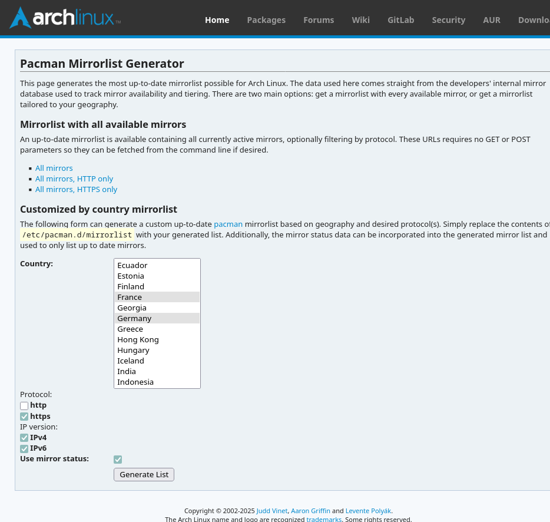

+++
author = 'Tehoor Marjan'
categories = ['linux']
date = '2025-06-25T02:27:24+02:00'
description = 'A comprehensive, step-by-step guide to migrating in-place from Manjaro to Arch Linux, keeping your desktop, settings, and Secure Boot with systemd-boot. Includes troubleshooting, rationale, and all commands.'
draft = false
image = 'images/posts/2025-06-25-how-to-migrate-in-place-from-manjaro-to-arch-linux/header.jpg'
keywords = ['arch linux', 'manjaro', 'migration', 'systemd-boot', 'secure boot', 'linux desktop', 'aur', 'pacman', 'reflector', 'unified kernel image', 'pamac', 'btrfs', 'linux kernel', 'linux tips', 'linux guide', 'linux troubleshooting']
slug = 'how-to-migrate-in-place-from-manjaro-to-arch-linux'
tags = ['arch-linux', 'manjaro', 'linux']
title = 'How to Migrate In-Place From Manjaro to Arch Linux'
+++

Manjaro is a fantastic way to get a fully-featured Linux desktop up and running
in minutes. Its graphical installer, sensible defaults, and curated package
selection making it a great choice for both newcomers and power users. However,
over time, I found that Manjaro’s repositories lagged behind Arch, and—at least
for the XFCE flavor—stability was not what I expected. I wanted to keep my
working setup, but move to a system that is easier and more stable to maintain:
pure Arch Linux.

This guide details how I migrated my Manjaro system to Arch **in place**,
without a full reinstall, while keeping systemd-boot and Secure Boot. It’s based
on Reddit post [Guide for Manjaro to Arch migration (the dirty way)][reddit] by
_Berlioz-Ubiquitus_ but updated for 2025 and based on my own experience.

[reddit]:
  https://www.reddit.com/r/ManjaroLinux/comments/jx42ar/guide_for_manjaro_to_arch_migration_the_dirty_way/



This guide assumes that you use `systemd-boot` as your bootloader and that you
have Secure Boot enabled. If you use `GRUB` or another bootloader, the
bootloader-related steps will be different, it's up to you to adapt the
instructions accordingly.





This process is advanced and potentially risky. Make a full backup before you
start. You are responsible for your own system!



## Step 0: Preparation

### Backup everything

If anything goes wrong, you’ll want a way to restore your system.

### Have an AUR Helper Installed

If you already have [yay](https://github.com/Jguer/yay), skip this step.
Otherwise just type `yay yay` in your terminal... Okay, not really, I'm kidding.
You can install `yay` using either of the following methods:

```bash
# If pamac is available:
pamac install yay

# Or install manually:
curl https://aur.archlinux.org/cgit/aur.git/snapshot/yay.tar.gz | tar -xzf - -C /tmp
cd /tmp/yay
makepkg -si --noconfirm
```

Any other AUR helper should work too, just use the one you prefer but you will
need to translate the commands below to your AUR helper of choice.

## Step 1: Switch to Arch Mirrors

### Migrate Mirrorlist

Edit your mirrorlist to use official Arch mirrors:

```bash
EDITOR=mousepad sudo -e /etc/pacman.d/mirrorlist
```

Paste in mirrors from
[https://archlinux.org/mirrorlist/](https://archlinux.org/mirrorlist/).



### Clean Up `pacman.conf`

Remove any Manjaro-specific settings:

```bash
sudo -e /etc/pacman.conf
```

- Remove `manjaro-system` from `HoldPkg`.
- I did not have any `SyncFirst=` line, but if you do, remove it.

### Update Package Database

```bash
sudo pacman -Scc  # Entirely clear the package cache
sudo pacman -Syy  # Force refresh the package database
```

### Update Pacman

```bash
sudo pacman -S pacman
sudo vimdiff /etc/pacman.conf{,.pacnew}
```

You may use `meld` or any other diff tool instead of `vimdiff` if you prefer.
Make sure to merge any new configuration options from `.pacnew` into your
existing `pacman.conf`. _I chose to keep Manjaro's default of
`SigLevel = PackageRequired` for all repos._

```bash
sudo pacman -Syy  # Force refresh the package database again
```

## Step 2: Reinstall All Native Packages

### Resolve file conflicts for key system files

These files are inherently different between Manjaro and Arch, so we let Arch's
version overwrite our older version.

```bash
sudo pacman -Sc --overwrite /etc/lsb-release --overwrite /etc/bash.bashrc --overwrite /etc/skel/.bashrc bash lsb-release
```

### Reinstall All Native Packages from Arch

This ensures all packages that are in the official repositories are from Arch,
not Manjaro:

```bash
pacman -Qqn | sudo pacman -S -
```



If during this step you get some errors about conflicting files, use the
`--overwrite` option together with the problematic package, like done above for
the key system files. **Take note of the conflicting package for step 4.**



## Step 3: Identify and Remove Manjaro-Specific Packages

### List All Manjaro Packages

List all packages installed from Manjaro. _(Actually, lists all packages that
are not from AUR or official Arch repositories.)_

```bash
pamac list -m | grep -v AUR | grep -ve "linux|pamac|pacman" | awk '{print $1}' | sed -z 's/\n/ /g' > /tmp/manjaro-special-packets.lst
```

Review and edit this list as needed.

- I strongly suggests you remove the `linux???` packages (kernel, headers and
  additional modules) so you can deal with them separately later.
- Remove `pacman-mirrors` if you have it in the list, as we will replace it
  manually.
- Also, in my case, I had some custom packages showing in this list (because
  they are neither from AUR nor official repositories), so I removed them from
  the list as well.

### Remove `pamac`

If you used `pamac-gtk`, remove it:

```bash
sudo pacman -Rs pamac-gtk
```

If you’ve already switched to `pamac-aur`, you can skip this.

### Replace `pacman-mirrors` with `pacman-mirrorlist`

```bash
sudo pacman -S pacman-mirrorlist
rm /etc/pacman.d/mirrorlist.pacnew  # We already have a mirrorlist properly configured
```

### Remove Manjaro-Specific Packages

```bash
sudo pacman -Rs $(cat manjaro-special-packets.lst)
```

## Step 4: Reinstall Overwritten System Files

```bash
sudo pacman -S bash lsb-release
```

_Add to the above command any other package that caused file conflicts during
the previous steps._

## Step 5: Install Arch Kernel

### Install Arch Kernel and Headers

```bash
sudo pacman -S linux linux-headers
```

### Update Initramfs

Edit `/etc/mkinitcpio.conf` to ensure it uses the correct hooks and modules. If
present in `MODULES`, remove `crc32c_intel` as it is obsolete (and absent) in
the latest Arch kernels.

```bash
sudo -e /etc/mkinitcpio.conf
```

Edit `/etc/mkinitcpio.d/linux.preset` to enable Unified Kernel Images.
_(Because, as said earlier, I assume you are using `systemd-boot` and Secure
Boot. If not, modify this file only according to your own setup.)_:

```ini
#default_config="/etc/mkinitcpio.conf"
#default_image="/boot/initramfs-linux.img"
default_uki="/efi/EFI/Linux/arch-linux.efi"
#default_options="--splash /usr/share/systemd/bootctl/splash-arch.bmp"

#fallback_config="/etc/mkinitcpio.conf"
#fallback_image="/boot/initramfs-linux-fallback.img"
fallback_uki="/efi/EFI/Linux/arch-linux-fallback.efi"
fallback_options="-S autodetect"
```

### Reinstall Plymouth

Ensure Plymouth is installed from the Arch repository. Setting the theme is
important because Manjaro's Plymouth theme has been now removed. You may of
course choose a different theme than `bgrt`, see
[ArchWiki Plymouth: Changing the theme](https://wiki.archlinux.org/title/Plymouth#Changing_the_theme).

```bash
sudo pacman -S plymouth
sudo plymouth-set-default-theme bgrt
```

### Regenerate Initramfs



This step is kind of a _dry run_, in order to ensure that the new kernel and
initramfs are properly configured. Be sure not to skip the later step where we
generate the final initramfs.



```bash
sudo mkinitcpio -p linux
```

### Remove Old Manjaro Kernel and Modules

_Only if the previous step was successful,_ you should now remove the old
Manjaro kernel and modules. I do not recommend keeping these, even as fallbacks,
as they may cause conflicts later on.

```bash
# Unregister the old Manjaro kernel files from Secure Boot
sudo sbctl remove-file /efi/EFI/Linux/manjaro-6.12-x86_64-fallback.efi
sudo sbctl remove-file /efi/EFI/Linux/manjaro-6.12-x86_64.efi
# If you have VirtualBox installed (or possibly other additional modules), temporarily allow to break the dependencies
sudo pacman -Rsdd linux612-virtualbox-host-modules
# Remove the old Manjaro kernel and modules
sudo pacman -Rs linux612
# Install the Arch's version of VirtualBox (or possibly other additional modules) to restore the dependencies
sudo pacman -S virtualbox-host-modules-arch
```

## Step 6: Reinstall Bootloader

### Reinstall systemd-boot and Regenerate UKI

I prefer starting fresh with the bootloader, so I remove everything that is
currently installed. (I could even remove the entire `/efi/` directory, but if
you have other bootloaders installed like Windows or other Linux distributions,
you may want to keep them.)

```bash
# Mr. Proper
sudo rm -r /efi/loader /efi/EFI/{Linux,systemd}
# Re-install systemd-boot
sudo bootctl install
# Recreate the Linux directory so mkinitcpio is happy
sudo mkdir -p /efi/EFI/Linux
# Regenerate the Unified Kernel Images
sudo mkinitcpio -p linux
```

### Sign Boot Files for Secure Boot

Start with a little check.

```bash
sudo sbctl verify
```

If some files are not signed, sign them.

```bash
sudo sbctl sign-all
sudo sbctl verify
```

If some files are still not signed, force-sign them and add them to the database
so sbctl will re-sign them automatically in the future.

```bash
sudo sbctl sign --save /efi/EFI/Linux/arch-linux.efi
sudo sbctl sign --save /efi/EFI/Linux/arch-linux-fallback.efi
```

Final check

```bash
sudo sbctl verify
```

## Step 7: Merge Configuration Files

### Merge `.pacnew` Files



You can replace `vimdiff` with `meld` or another diff tool if you're more
comfortable with it (`meld` is graphical).

If for some reason you're stuck in the console and you can't use meld, here is a
very quick cheatsheet for vimdiff:

- `Ctrl+w w`: Yes, "w" twice: Switch between windows (left and right)
- `do` : Diff obtain: Import changes from the other window to the current one
  (only the current chunk your cursor is on)
- `dp` : Diff put: Export changes from the current window to the other one (in
  our case, it's useful if you switched to the .pacnew file window)
- `:w` : Save the current window
- `:qa` : Quit all windows
- `V` : Visual mode: Select the current line, useful for selecting multiple
  lines to copy/paste
- `v` : Visual mode: Select text character by character
- `y` : Yank (copy) the selection (or yy to copy the current line if not in
  visual mode)
- `p` : Paste the yanked selection
- `i` : Insert mode: Switch to insert mode to edit the text, Esc to exit insert
  mode

So in general, scroll through the file, use `do` to import changes from the
`.pacnew` file and `:w` then `:qa` to save and quit.

If you need finer control, use `Ctrl+w w` to switch between the two windows and
use `V` or `v` to select text, then `y` to yank it, `Ctrl+w w` to switch back to
the other window and `p` to paste it there.

Use `i` to make manual edits in the current window, then `Esc` to exit insert
mode.



```bash
sudo -i  # Start a root shell
```

`passwd` file is very specific to what you installed, so you may not want to
merge it

```bash
rm /etc/passwd.pacnew
```

Manually review and merge as needed (here are some common files that may have
`.pacnew` versions, you may have more)

```bash
find /etc -name "*.pacnew"
```

- `/etc/systemd/logind.conf`: Unless you have custom settings, you can just use
  the `.pacnew` version.

  ```bash
  mv /etc/systemd/logind.conf{.pacnew,}
  ```

- `/etc/systemd/sleep.conf`: Unless you have custom settings, you can just use
  the `.pacnew` version.

  ```bash
  mv /etc/systemd/sleep.conf{.pacnew,}
  ```

- `/etc/plymouth/plymouthd.conf`: Probably nothing fancy apart from the theme.
- `/etc/hosts`: I chose to keep the additional Manjaro entries for ipv6 nodes
  and routers.
- `/etc/nsswitch.conf`: I chose to keep Manjaro's setup for `mdns4`.
- `/etc/shells`: I removed the additional shells Manjaro added out of (light)
  safety concerns, but it's probably safe to keep them.
- `/etc/pacman.conf`: I chose to keep Manjaro's default of
  `SigLevel = PackageRequired` fro all repos.

Once you have merged all the necessary `.pacnew` files, you can remove them:

```bash
rm $(find /etc -name "*.pacnew")
```

### Clean Up `.pacsave` and `.pacorig` Files

`.pacsave`: These files are created when a configuration file is no longer
needed. This may indicate that an important packet has been removed. You must
check if this is normal (superseded by a new package) or if you need to restore
the packet.

```bash
find /etc -name "*.pacsave"        # List all .pacsave files
rm $(find /etc -name "*.pacsave")  # Remove them once you have checked them
```

`.pacorig`: These files should no longer be created by `pacman`, but given the
special context of our migration, you may find some. They are to be treated like
`.pacnew` files, but reversed (e.g. the `.pacorig` was there before the
migration and the file without the `.pacorig` is the new version).

```bash
find /etc -name "*.pacorig"        # List all .pacorig files
rm $(find /etc -name "*.pacorig")  # Remove them once you have checked them
```

## Step 8: Preparing for the Big Jump

### (Optional) Install reflector for Better Mirrors

```bash
sudo pacman -S reflector
# Edit reflector config to your liking, e.g. sort by speed, country, etc.
sudo -e /etc/xdg/reflector/reflector.conf
# Enable the reflector timer to update mirrors periodically
sudo systemctl enable reflector.timer
# Manually run reflector to update the mirrorlist immediately
sudo systemctl start reflector
# Force refresh the package database after updating mirrors
sudo pacman -Syyu
```

### Reinstall Essential Packages

Some packages may have been removed or replaced. Reinstall as needed:

```bash
sudo pacman -S networkmanager pipewire pipewire-audio pipewire-pulse pipewire-alsa
```

Notably, `networkmanager` should be re-installed because Manjaro has a Pacman
hook that automatically changes the server for pings. It's not a big deal, but
since we're switching to Arch, we want to keep the default behavior.

`pipewire` and its related packages were probably removed because they were
marked as dependencies of a Manjaro-specific package that was removed.

### A Note about `xf86-video-intel`

If you are using Intel graphics, make sure you **don’t** have the
`xf86-video-intel` package installed, because it takes precedence over the
`modesetting` driver and doesn't work. I'm not sure if Manjaro installs it by
default or if I installed it myself by mistake during the migration, but it
broke my display after the migration. If you have it installed, remove it:

```bash
sudo pacman -Rs xf86-video-intel
```

## Step 9: Verify and Reboot

Okay, you're going to say that I have OCD, but I really hate to have to return
to BIOS, disable Secure Boot, reboot, re-enable Secure Boot, and then boot
again. So I prefer to verify everything is fine before rebooting.

```bash
sudo sbctl verify
```

Now my OCD is satisfied, so let's reboot!

```bash
sudo reboot
```

## Step 10: Are You Still Alive?

You did make it? Wow, congratulations! You've passed the hardest part of the
migration.

### Restore System Settings

For some reason, my system lost some vital settings during the migration.
Namely, the locale and hostname. Just in case, I set the keymaps again as well,
so that `systemd` aligns all the configuration files, should some new ones be
necessary on the new system (for Wayland, maybe?). Of course, if you're not
French (nobody's perfect), change the locale and keymap to your own.

```bash
sudo localectl set-locale fr_FR.UTF-8
sudo localectl set-keymap fr
sudo localectl set-x11-keymap fr pc105 oss terminate:ctrl_alt_bksp,compose:rctrl
sudo hostnamectl set-hostname lucidmechanisms
```

_Note: If your hostname is now `lucidmechanisms`, it's because you forgot to
tweak the above line to your own hostname, silly you!_

## Step 11: Reinstall AUR Packages

### Reinstall All AUR Packages

If you had AUR packages installed, it's a good idea to reinstall them now that
you are on Arch. This ensures they are built against the new Arch libraries and
dependencies. I know, I know, this is a pain, this is long and tedious, but it's
worth it. Think about all the troubles you will **not** have in the future
because you did this now.

```bash
pacman -Qqm | yay -S -
```

### (Optional) Install `pamac-aur`

If you liked the convenience of `pamac` on Manjaro, you can install the AUR
version of `pamac` for Arch. This will give you a GUI package manager similar to
what you had on Manjaro.

```bash
yay -S pamac-aur archlinux-appstream-data-pamac
```

## Step 12: Final Reboot

A final reboot is probably a good idea given all the changes we made. Don't
worry, it's the last one (I know, if you're like me, you reboot maybe once a
month, so twice a day is a lot. You can compensate by not rebooting for the next
two months).

```bash
sudo reboot
```

### Non-Disclosure Agreement

A very important final note: by following this guide, you agree to never tell
anyone that you migrated from Manjaro to Arch Linux. This is a secret between
you and me, okay? If you go to the Arch forums or Reddit and say "I migrated
from Manjaro to Arch", they will hate you forever. You must say "I have always
been on Arch for decades, and out of nowhere there is this problem showing up, I
did nothing and I don't know what you're talking about"!

Enjoy your new system—and welcome to the Arch side!
