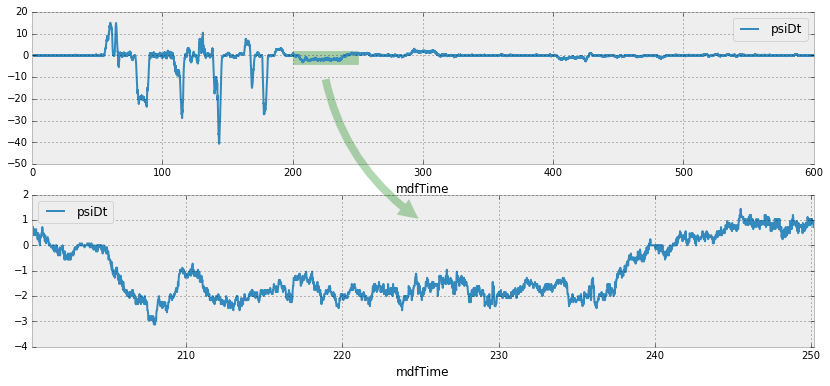

+++
author = 'Cilyan Olowen'
categories = ['python', 'code']
date = '2016-01-23T12:00:53+01:00'
description = 'Dessiner entre différents sous-graphiques sur une seule figure Matplotlib'
draft = false
image = 'images/posts/2016-01-23-matplotlib-draw-between-subplots/header.webp'
keywords = ['matplotlib', 'sous-graphiques', 'figure', 'python', 'pandas']
slug = 'matplotlib-dessiner-entre-les-sous-graphiques'
tags = ['featured', 'python', 'matplotlib', 'pandas', 'code']
title = 'Matplotlib : dessiner entre les sous-graphiques'
+++

La semaine dernière, je préparais un rapport d'analyse de données avec
[Jupyter](http://jupyter.org/), [Pandas](http://pandas.pydata.org/) et
[Matplotlib](http://matplotlib.org/) (pour ne citer que quelques briques de ce
fabuleux framework). Une des figures contenait deux sous-graphiques : le second
étant un agrandissement d'une région du premier. Pour bien illustrer cela et, au
passage, montrer au fanclub MATLAB à quel point ils sont restés "so 90s", j'ai
décidé de tracer une flèche entre les deux sous-graphiques.

<div class="text-center rounded-lg bg-theme-light/30 my-3">



</div>

Hélas, cette idée simple m'a conduit à trois heures de recherche intense sur
Internet, entre essais, erreurs, et même quelques plantages. J'étais à deux
doigts de m'incliner devant la technologie du siècle dernier… Mais pas question
!

## Artistes et transformations

_Si vous voulez juste vous vanter du résultat final, passez cette section._ Je
vais juste expliquer vite-fait ce qui se passe sous le capot. Alors, figures,
axes, abscisses, c'est quoi tout ça ? Je ne saurais trouver une meilleure
explication que le
[tutoriel sur les "artistes" de Matplotlib](http://matplotlib.org/users/artists.html),
mais je vais essayer de résumer. Avec Matplotlib, vous dessinez sur un _Canvas_
en utilisant un _Renderer_. Les objets capables d'utiliser un renderer pour
dessiner sur le canvas s'appellent des "artistes".

**_Il existe deux types d'artistes : les primitives et les conteneurs. Les
primitives représentent les objets graphiques standards que nous voulons
dessiner sur le canvas : Line2D, Rectangle, Text, AxesImage, etc. Les conteneurs
sont des endroits pour les y mettre (Axis, Axes et Figure)._**

On en déduit qu'il nous faut créer une _primitive_, à savoir un `Patch`, et plus
précisément dans notre cas un `FancyArrowPatch`, qu'on ajoutera à la figure.
Facile.

Mais il y a un autre aspect à considérer. Comme nous ajoutons un patch à la
figure, on peut s'attendre à ce qu'il soit dessiné en utilisant les coordonnées
de la figure. Ce n'est pas très simple quand il s'agit de bien placer la flèche.
Pour résoudre cela, il faut comprendre comment fonctionnent les transformations.
Là encore, il existe un excellent
[tutoriel sur les transformations](http://matplotlib.org/users/transforms_tutorial.html),
et je ne saurais mieux expliquer. Lorsque vous traitez des coordonnées dans
Matplotlib, il faut savoir à quel système de coordonnées elles se rapportent. Il
y a 4 systèmes de coordonnées :

| Coordonnées | Objet de transformation | Description                                                                                                                                                               |
| ----------- | ----------------------- | ------------------------------------------------------------------------------------------------------------------------------------------------------------------------- |
| `data`      | `ax.transData`          | Coordonnées des données utilisateur, contrôlées par xlim et ylim                                                                                                          |
| `axes`      | `ax.transAxes`          | Coordonnées des [axes](http://matplotlib.org/api/axes_api.html#matplotlib.axes.Axes) ; (0,0) correspond au coin inférieur gauche, (1,1) au coin supérieur droit.          |
| `figure`    | `fig.transFigure`       | Coordonnées de la [figure](http://matplotlib.org/api/figure_api.html#matplotlib.figure.Figure) ; (0,0) pour le coin inférieur gauche, (1,1) pour le coin supérieur droit. |
| `display`   | `None`                  | Coordonnées en pixels de l'écran ; (0,0) pour le coin inférieur gauche, (largeur, hauteur) pour le coin supérieur droit.                                                  |

Le système de référence est `display`, et les objets de transformation décrivent
comment transformer des coordonnées vers ce système de référence. Nous savons où
positionner la flèche dans les données (c'est à dire ses coordonnées dans le
système `data`), mais pas où cela se place sur la figure complète. En appliquant
une transformation via l'objet de transformation des données, nous obtenons les
coordonnées en pixels. Une étape. Ensuite, il suffit d'inverser la
transformation en utilisant l'objet de transformation de la figure pour
convertir depuis les coordonnées pixels au système de coordonnées de la figure.

Dernier point, il faut indiquer explicitement le système de coordonnées utilisé
lors de la création du patch avec le paramètre `transform`.

## Montre-moi le code

OK, sortez vos données, configurez le graphique ! Dans l'exemple ci-dessous,
j'utilise un DataFrame Pandas, mais cela fonctionnerait tout aussi bien avec des
tableaux NumPy.

```python
import matplotlib.pyplot as plt
import matplotlib.patches

fig, axes = plt.subplots(2)
# Affiche la mesure complète pour comparaison sur l'axe 0
testdata.plot(ax=axes[0], x="mdfTime", y="psiDt")
# Place un petit rectangle pour marquer la zone agrandie
axes[0].add_patch(matplotlib.patches.Rectangle((200., -4.), 50., 6., transform=axes[0].transData, alpha=0.3, color="g"))
# Agrandissement de la mesure sur l'axe 1
testdata[int(200./0.02):int(250./0.02)].plot(ax=axes[1], x="mdfTime", y="psiDt")
```

Et enfin, la partie vraiment intéressante :

```python
# Créer la flèche
# 1. Obtenir les objets de transformation pour les axes et la figure
ax0tr = axes[0].transData # Axe 0 -> Affichage
ax1tr = axes[1].transData # Axe 1 -> Affichage
figtr = fig.transFigure.inverted() # Affichage -> Figure
# 2. Transformer le point de départ de la flèche de l'axe 0 aux coordonnées de la figure
ptB = figtr.transform(ax0tr.transform((225., -10.)))
# 3. Transformer le point final de la flèche de l'axe 1 aux coordonnées de la figure
ptE = figtr.transform(ax1tr.transform((225., 1.)))
# 4. Créer le patch
arrow = matplotlib.patches.FancyArrowPatch(
    ptB, ptE, transform=fig.transFigure,  # Place la flèche dans le système de coord. de la figure
    fc="g", connectionstyle="arc3,rad=0.2", arrowstyle='simple', alpha=0.3,
    mutation_scale=40.
)
# 5. Ajouter le patch à la liste des objets à dessiner sur la figure
fig.patches.append(arrow)
```

<div class="text-center rounded-lg my-3 bg-theme-light/30">


</div>

Si vous travaillez avec des lignes, le processus est similaire, mais vous devez
ajouter votre objet personnalisé à la propriété `lines` de la figure au lieu de
`patches`. Jettez un œil à cette
[question sur StackOverflow](http://stackoverflow.com/questions/17543359/drawing-lines-between-two-plots-in-matplotlib/17560223#17560223).
