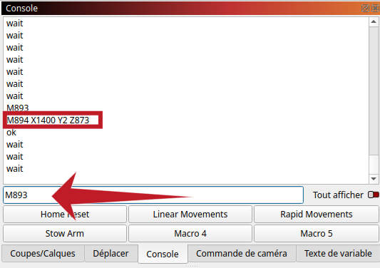

+++
author = 'Tehoor Marjan'
categories = ['creation']
date = '2025-01-21T13:31:36+01:00'
description = 'Un guide pratique pour configurer et utiliser le Rotrics DexArm avec le logiciel LightBurn pour la gravure et la découpe laser.'
draft = false
image = 'images/posts/2025-01-21-how-to-set-up-and-use-the-rotrics-dexarm-with-lightburn/header.webp'
keywords = ['dexarm', 'rotrics', 'lightburn', 'découpe-laser', 'robotique', 'diy']
math = true
slug = 'comment-configurer-et-utiliser-le-rotrics-dexarm-avec-lightburn'
tags = ['creation', 'dexarm', 'laser-cutting', 'lightburn']
title = 'Comment configurer et utiliser le Rotrics DexArm avec LightBurn'
+++

Le [Rotrics DexArm][dexarm] est une addition intrigante et originale dans le
monde de l'impression 3D et de la découpe laser. Contrairement aux découpeuses
laser traditionnelles, c’est un bras robotique de petite taille à 4 axes avec
une grande modularité, lui permettant de passer facilement de la gravure laser à
l’impression 3D, le tracé et même la préhension d’objets.

Cette flexibilité s’accompagne de défis particuliers, notamment lorsqu’il s’agit
de l’intégrer à des logiciels comme [LightBurn][lightburn], principalement conçu
pour des configurations conventionnelles.

<!-- more -->

Malheureusement, si vous n’en possédez pas encore un, je ne peux pas vous le
recommander. _Rotrics_ a abandonné son produit il y a quelque temps, ne
s'occupant plus que des ventes. Le logiciel [Rotrics Studio][studio] est
notoirement bogué et pauvre en fonctionnalités. Mais si vous êtes l’un des
heureux (ou malheureux) propriétaires de DexArm, ne vous inquiétez pas : il y a
de l’espoir !

Aujourd’hui, je vais vous guider dans la configuration du DexArm sur
[LightBurn][lightburn], un puissant logiciel pour la découpe et la gravure
laser. Cet article est une mise à jour de la [page de configuration LightBurn
sur le wiki fandom][wiki].



<p class="text-xl font-bold">
 Utilisateurs Linux
</p>

[Le support de LightBurn sur Linux a pris fin après la version 1.7.00.][support]
Si vous utilisez Linux, gardez cela à l’esprit avant un éventuel achat.

[support]:
  https://forum.lightburnsoftware.com/t/linux-support-to-end-after-v1-7/144605/1



## Première étape

Quand vous ouvrez LightBurn pour la première fois, il va automatiquement vous
inviter à créer un nouveau périphérique. Sinon, vous pouvez accéder manuellement
à la configuration en cliquant sur le bouton _Appareils_ situé dans la barre
latérale du panneau _Laser_.



## TL;DR : Importer le fichier

Si vous êtes pressé et voulez une configuration rapide, vous pouvez sauter le
processus manuel et utiliser mon fichier préconfiguré. Téléchargez-le et
importez-le dans LightBurn :

<div class="not-prose text-xl text-black dark:text-white">

<i class="fa-solid fa-file-arrow-down"></i> [dexarm.lbdev](./dexarm.lbdev)

</div>



Et c’est tout ! Vous pouvez passer directement à [comment utiliser la
configuration]().

## Configuration manuelle

### Créer un nouveau périphérique



Choisissez l’option _Créer manuellement_ en utilisant l’assistant.



Pour le type de contrôleur, choisissez _Marlin_. Le firmware du DexArm est une
version personnalisée du firmware open-source populaire [Marlin][marlin].



Ensuite, donnez un nom à votre périphérique (par exemple, "DexArm"). Réglez les
dimensions sur $300\,\text{mm}$ (axe X) et $220\,\text{mm}$ (axe Y). Cette
configuration garantit une compatibilité avec les avertissements de l’espace de
travail de LightBurn, même si le bras ne pourra pas atteindre physiquement les
coins les plus éloignés.



Pour l’origine du laser, choisissez _Arrière Droit_. Bien que ce ne soit pas
exact, c’est l’option la plus intuitive compte tenu des limites de LightBurn.

### Configurer les paramètres du périphérique

Allez dans _Éditer > Paramètres du périphérique_ pour ajuster certains
paramètres importants.



- Activez le contrôle de l’axe Z.
- Activez le bouton de déclenchement du laser.
- _Optionnel_ : Activez Laser activé lors du cadrage et définissez la puissance
  du laser à `0.50%`.
- Sélectionnez `M03/M05` comme commandes d’allumage/extinction du laser.
- Vérifiez que le débit en bauds est réglé sur `115200`.
- Réglez le mode de transfert sur _Synchrone_.



Dans l’onglet _GCode_, vous pouvez ajouter la commande `M2000` au démarrage pour
garantir que le bras fonctionne en mode linéaire. Bien que LightBurn utilise
principalement des commandes `G1`, cela agit comme une mesure de sécurité
supplémentaire.

### Macros

Activez le panneau _Console_ via le menu _Fenêtre_. Dans l’onglet _Console_,
vous pouvez entrer des commandes G-code personnalisées ou configurer des macros
(boutons exécutant des commandes).



Pour configurer une macro, cliquez avec le bouton droit sur un bouton dans le
Panneau _Console_ et entrez un titre et le contenu du G-code.



Configurez les boutons suivants :

<table>
<tr><th>Intitulé du bouton</th><th>Contenu de la macro</th></tr>
<tr><td>Home Reset</td>
<td>

```plaintext
M1112
M888 P1
G92 X150 Y130 Z0
```

</td>
</tr>
<tr><td>Linear Movements</td>
<td>

```plaintext
M2000
```

</td>
</tr>
<tr><td>Rapid Movements</td>
<td>

```plaintext
M2001
```

</td>
</tr>
<tr><td>Stow Arm</td>
<td>

```plaintext
M894 X1400 Y1 Z878
```

</td>
</tr>
</table>

{}

Pour la macro _Stow Arm_, vous devrez peut-être personnaliser les valeurs.
Éteignez le bras, placez-le manuellement en position repliée, rallumez-le, et
envoyez la commande `M893` dans le Panneau _Console_. Le bras retournera une
commande `M894` avec les valeurs nécessaires.



{}

## Utilisation

### Préparation

Allumez le DexArm et ouvrez LightBurn.

Si ce n’est pas encore fait, activez le Panneau _Console_ via le menu _Fenêtre_.
Une fois activé, un nouvel onglet appelé _Console_ apparaît dans la barre
latérale.

Dans le panneau _Laser_, sélectionnez le port de communication correct (par
exemple `/dev/ttyACMx` sur Linux, `COMx` sur Windows, `/dev/tty.x` sur Mac) et
choisissez le périphérique _DexArm_.

Assurez-vous également que _Démarrer à partir de_ est réglé sur _Coordonnées
Absolues_.



À l’aide du panneau _Console_, cliquez sur _Home Reset_. ⚠️ Le bras bouge ! Cela
placera le bras au centre de la zone de travail.

{}

La macro _Home Reset_ garantit que le bras est aligné avec le système de
coordonnées de LightBurn. Elle effectue les actions suivantes :

- `M1112` : Déplace le bras à la position d'origine usine.
- `M888 P3` : Définit l'outil actuel comme étant le laser. Cette information est
  nécessaire pour que le bras traduise les coordonnées cartésiennes en rotations
  des axes, car la position exacte de la sortie de l'outil varie légèrement
  selon qu'il s'agit du faisceau laser, de la buse d'extrusion, du porte-crayon,
  etc.  
  _Remarque : Malgré la documentation plus ancienne suggérant `M880`, les
  nouveaux firmwares nécessitent la commande `M888` pour la sélection de
  l'outil._
- `G92 X150 Y130 Z0` : Ajuste les coordonnées de travail pour faire de la
  position actuelle $X = 150\,\text{mm}$, $Y = 130\,\text{mm}$,
  $Z = 0\,\text{mm}$.

{}

Le bras est maintenant prêt à être utilisé.

### Zone de travail

Même si on a configuré la zone de travail pour une taille de
$300\,\text{mm} \times 220\,\text{mm}$, il faut savoir qu'à peu de choses près,
le bras ne pourras pas descendre en-dessous de $Y = 10\,\text{mm}$ lorsqu'il est
droit ($X \approx 150\,\text{mm}$).

En revanche, les angles situés dans la zone de travail en haut de la fenêtre
seront bien accessibles ($(0, 0)$ et $(300, 0)$). Enfin, si le bras peut
atteindre facilement $y = 220\,\text{mm}$ droit devant lui, les angles les plus
éloignés (en bas sur l'écran) ne seront pas accessibles ($(0, 220)$ et
$(300, 220)$).



Vous pouvez vérifier avec l'outil position de LightBurn que les endroits les
plus éloignés et les plus proches sur votre gravure sont accessibles avec le
bras avant de lancer l'impression réelle.

### Calibration pour l'impression et la découpe {.clear-both}

Consultez la documentation LightBurn [Print and Cut][printncut] ou regardez la
vidéo :



{}

Le DexArm possède deux modes de mouvement que vous pouvez sélectionner à l'aide
des boutons macro : _Rapid Movements_ ou _Linear Movements_.

- En mode _Linear Movements_, la tête du laser dessine une ligne droite entre le
  point de départ et le point d’arrivée. Ce mode est indispensable pour
  l'impression ou la découpe. Cependant, du point de vue des axes de rotation,
  cela peut impliquer des mouvements d'aller-retour, inutiles si vous voulez
  simplement déplacer le bras.
- En mode _Rapid Movements_, le bras effectue des mouvements plus directs et
  rapides, ce qui est pratique pour les ajustements et la calibration.

Sélectionnez _Rapid Movements_ pour effectuer des réglages ou des calibrations.
Sélectionnez _Linear Movements_ uniquement lorsque vous gravez ou découpez
réellement. Par défaut, l'appareil passe automatiquement en mode _Linear
Movements_ au début d'une tâche d'impression.

{}

### Ranger le bras

Avant d’éteindre le DexArm, utilisez la macro _Stow Arm_. Cela permet au bras de
se rétracter dans une position sûre, évitant tout dommage lorsqu’il est mis hors
tension. (Lorsque le couple est relâché par le moteur et que le bras est étendu,
son poids peut lui faire heurter la table ou une pièce finie, endommageant à la
fois le bras et le support.)

Et voilà — votre DexArm est configuré et prêt à créer !

[dexarm]: https://rotrics.com/products/dexarm
[lightburn]: https://lightburnsoftware.com/
[marlin]: https://marlinfw.org/
[studio]: https://rotrics.com/pages/downloads
[wiki]: https://dexarm.fandom.com/wiki/Lightburn_Configuration
[printncut]: https://docs.lightburnsoftware.com/1.7/Reference/PrintAndCut/
