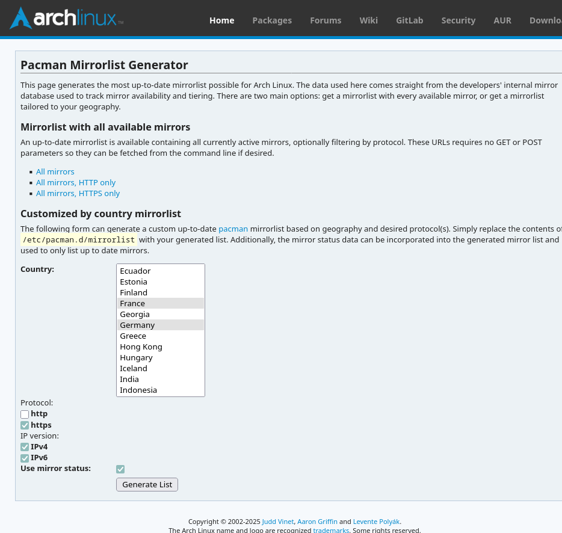

+++
author = 'Tehoor Marjan'
categories = ['linux']
date = '2025-06-25T02:27:24+02:00'
description = 'Un guide complet, étape par étape, pour migrer sur place de Manjaro vers Arch Linux, en conservant votre bureau, vos paramètres et le Secure Boot avec systemd-boot. Comprend le dépannage, les raisons, et toutes les commandes.'
draft = false
image = 'images/posts/2025-06-25-how-to-migrate-in-place-from-manjaro-to-arch-linux/header.jpg'
keywords = ['arch linux', 'manjaro', 'migration', 'systemd-boot', 'secure boot', 'linux desktop', 'aur', 'pacman', 'reflector', 'unified kernel image', 'pamac', 'btrfs', 'linux kernel', 'linux tips', 'linux guide', 'linux troubleshooting']
slug = 'comment-migrer-de-manjaro-vers-arch-linux-a-chaud'
tags = ['arch-linux', 'manjaro', 'linux']
title = 'Comment migrer de Manjaro vers Arch Linux à chaud'
+++

Manjaro est une excellente façon d'obtenir un bureau Linux complet et
fonctionnel en quelques minutes. Son installateur graphique, ses choix par
défaut judicieux et sa sélection de paquets bien pensée en font une très bonne
option pour les débutants comme pour les utilisateurs avancés. Cependant, avec
le temps, j'ai constaté que les dépôts de Manjaro accusaient un certain retard
par rapport à ceux d'Arch, et que – du moins pour la version XFCE – la stabilité
n'était pas au rendez-vous. Je voulais conserver mon environnement de travail
tel quel, mais passer à un système plus simple et plus stable à maintenir : Arch
Linux pur.

Ce guide décrit en détail comment j'ai migré mon système Manjaro vers Arch **sur
place**, sans réinstallation complète, tout en conservant systemd-boot et le
Secure Boot. Il est basé sur le post Reddit [Guide for Manjaro to Arch migration
(the dirty way)][reddit] de _Berlioz-Ubiquitus_, mais mis à jour pour 2025 et
enrichi de ma propre expérience.

[reddit]:
  https://www.reddit.com/r/ManjaroLinux/comments/jx42ar/guide_for_manjaro_to_arch_migration_the_dirty_way/



Ce guide suppose que vous utilisez `systemd-boot` comme chargeur d'amorçage et
que le Secure Boot est activé. Si vous utilisez `GRUB` ou un autre chargeur, les
étapes liées au bootloader seront différentes, à vous d'adapter les instructions
en conséquence.





Ce processus est complexe et potentiellement risqué. Faites une sauvegarde
complète avant de commencer. Vous êtes responsable de votre système !



## Étape 0 : Préparation

### Sauvegardez tout

Si quelque chose se passe mal...

### Avoir un gestionnaire AUR installé

Si vous avez déjà [yay](https://github.com/Jguer/yay), passez cette étape.
Sinon, tapez simplement `yay yay` dans votre terminal... Non, je plaisante. Vous
pouvez installer `yay` avec l'une des méthodes suivantes :

```bash
# Si pamac est disponible :
pamac install yay

# Ou installation manuelle :
curl https://aur.archlinux.org/cgit/aur.git/snapshot/yay.tar.gz | tar -xzf - -C /tmp
cd /tmp/yay
makepkg -si --noconfirm
```

Tout autre gestionnaire AUR fera aussi l'affaire : utilisez celui que vous
préférez, mais il vous faudra adapter les commandes suivantes.

## Étape 1 : Basculer vers les dépôts Arch

### Mettre à jour la liste des miroirs

Modifiez votre liste de miroirs pour utiliser ceux d'Arch :

```bash
EDITOR=mousepad sudo -e /etc/pacman.d/mirrorlist
```

Collez les miroirs depuis
[https://archlinux.org/mirrorlist/](https://archlinux.org/mirrorlist/).



### Nettoyer `pacman.conf`

Supprimez les paramètres propres à Manjaro :

```bash
sudo -e /etc/pacman.conf
```

- Supprimez `manjaro-system` de `HoldPkg`.
- Je n'avais pas de ligne `SyncFirst=`, mais si c'est votre cas, supprimez-la.

### Mettre à jour la base de données des paquets

```bash
sudo pacman -Scc  # Vider complètement le cache
sudo pacman -Syy  # Forcer la mise à jour des index
```

### Mettre à jour pacman

```bash
sudo pacman -S pacman
sudo vimdiff /etc/pacman.conf{,.pacnew}
```

Vous pouvez utiliser `meld` ou tout autre outil de comparaison si vous préférez.
Pensez à fusionner les nouvelles options de configuration du `.pacnew` dans
votre fichier existant. _De mon côté, j'ai décidé de conserver la configuration
de Manjaro `SigLevel = PackageRequired` pour tous les dépôts._

```bash
sudo pacman -Syy  # Rafraîchir encore une fois la base
```

## Étape 2 : Réinstaller tous les paquets natifs

### Gérer les conflits sur les fichiers système clés

Ces fichiers sont par nature différents entre Manjaro et Arch, donc on laisse
Arch les écraser :

```bash
sudo pacman -Sc --overwrite /etc/lsb-release --overwrite /etc/bash.bashrc --overwrite /etc/skel/.bashrc bash lsb-release
```

### Réinstaller tous les paquets natifs depuis Arch

On remplace tous les paquets Manjaro par leurs équivalents Arch. Cela garantit
que tous les paquets installés proviennent des dépôts Arch, et non de Manjaro.

```bash
pacman -Qqn | sudo pacman -S -
```



Si des erreurs apparaissent à cause de fichiers en conflit, utilisez l'option
`--overwrite` avec le paquet concerné, comme dans l'exemple précédent. **Notez
les paquets en conflit pour l'étape 4.**



## Étape 3 : Identifier et supprimer les paquets spécifiques à Manjaro

### Lister tous les paquets Manjaro

Listez tous les paquets installés provenant de Manjaro. _(En fait, cela liste
tous les paquets qui ne viennent ni de l'AUR ni des dépôts officiels d'Arch.)_

```bash
pamac list -m | grep -v AUR | grep -ve "linux|pamac|pacman" | awk '{print $1}' | sed -z 's/\n/ /g' > /tmp/manjaro-special-packets.lst
```

Passez cette liste en revue et modifiez-la si besoin.

- Je recommande fortement de retirer les paquets `linux???` (noyaux, headers et
  modules) pour les gérer séparément ensuite.
- Supprimez `pacman-mirrors` si présent, car nous allons le remplacer
  manuellement.
- Dans mon cas, certains paquets personnalisés apparaissaient aussi dans cette
  liste (car ils ne viennent ni de l'AUR ni des dépôts officiels), je les ai
  donc également retirés.

### Supprimer `pamac`

Si vous utilisiez `pamac-gtk`, supprimez-le :

```bash
sudo pacman -Rs pamac-gtk
```

Si vous étiez déjà passé à `pamac-aur`, vous pouvez ignorer cette étape.

### Remplacer `pacman-mirrors` par `pacman-mirrorlist`

```bash
sudo pacman -S pacman-mirrorlist
rm /etc/pacman.d/mirrorlist.pacnew  # Nous avons déjà une liste correctement configurée
```

### Supprimer les paquets spécifiques à Manjaro

```bash
sudo pacman -Rs $(cat manjaro-special-packets.lst)
```

## Étape 4 : Réinstaller les fichiers système écrasés

```bash
sudo pacman -S bash lsb-release
```

_Ajoutez à cette commande tous les paquets ayant causé des conflits de fichiers
pendant les étapes précédentes._

## Étape 5 : Installer le noyau Arch

### Installer le noyau Arch et ses en-têtes

```bash
sudo pacman -S linux linux-headers
```

### Mettre à jour l’initramfs

Modifiez `/etc/mkinitcpio.conf` pour vous assurer qu’il contient les bons hooks
et modules. Si `crc32c_intel` est présent dans `MODULES`, supprimez-le : il est
obsolète (et absent) dans les noyaux Arch récents.

```bash
sudo -e /etc/mkinitcpio.conf
```

Modifiez `/etc/mkinitcpio.d/linux.preset` pour activer les images UKI. _(Puisque
je pars du principe que vous utilisez `systemd-boot` avec Secure Boot, sinon
modifiez ce fichier seulement selon votre configuration.)_

```ini
#default_config="/etc/mkinitcpio.conf"
#default_image="/boot/initramfs-linux.img"
default_uki="/efi/EFI/Linux/arch-linux.efi"
#default_options="--splash /usr/share/systemd/bootctl/splash-arch.bmp"

#fallback_config="/etc/mkinitcpio.conf"
#fallback_image="/boot/initramfs-linux-fallback.img"
fallback_uki="/efi/EFI/Linux/arch-linux-fallback.efi"
fallback_options="-S autodetect"
```

### Réinstaller Plymouth

Assurez-vous que Plymouth est installé depuis les dépôts Arch. Le paramétrage du
thème est important, car celui de Manjaro a été supprimé. Vous pouvez bien
entendu choisir un autre thème que `bgrt`. Voir :
[ArchWiki Plymouth: Changing the theme](https://wiki.archlinux.org/title/Plymouth#Changing_the_theme)

```bash
sudo pacman -S plymouth
sudo plymouth-set-default-theme bgrt
```

### Générer l’initramfs



Cette étape est une sorte de _test_ pour s'assurer que le nouveau noyau et
l'initramfs sont bien configurés. Ne manquez pas l'étape suivante qui génère les
versions finales.



```bash
sudo mkinitcpio -p linux
```

### Supprimer l'ancien noyau Manjaro et ses modules

_Uniquement si l'étape précédente a réussi_, vous pouvez maintenant supprimer
l'ancien noyau Manjaro et ses modules. Je ne recommande pas de les conserver,
même comme sauvegarde, car cela pourrait provoquer des conflits plus tard.

```bash
# Désenregistrer les anciens fichiers signés pour Secure Boot
sudo sbctl remove-file /efi/EFI/Linux/manjaro-6.12-x86_64-fallback.efi
sudo sbctl remove-file /efi/EFI/Linux/manjaro-6.12-x86_64.efi
# Si vous avez VirtualBox (ou d’autres modules), autorisez temporairement de casser la dépendance
sudo pacman -Rsdd linux612-virtualbox-host-modules
# Supprimez l'ancien noyau et ses modules
sudo pacman -Rs linux612
# Réinstallez la version Arch de VirtualBox (ou autre) pour réparer la dépendance
sudo pacman -S virtualbox-host-modules-arch
```

## Étape 6 : Réinstaller le chargeur d'amorçage

### Réinstaller systemd-boot et régénérer l'UKI

Je préfère repartir de zéro pour le bootloader, donc je supprime tout ce qui est
installé actuellement. (Je pourrais même supprimer tout le répertoire `/efi/`,
mais si vous avez d'autres systèmes comme Windows ou une autre distrib Linux,
conservez-les !)

```bash
# Mr. Propre
sudo rm -r /efi/loader /efi/EFI/{Linux,systemd}
# Réinstaller systemd-boot
sudo bootctl install
# Recréer le dossier Linux pour faire plaisir à mkinitcpio
sudo mkdir -p /efi/EFI/Linux
# Régénérer les images noyau unifiées (UKI)
sudo mkinitcpio -p linux
```

### Signer les fichiers de boot pour le Secure Boot

Commencez par une petite vérification :

```bash
sudo sbctl verify
```

Si certains fichiers ne sont pas signés, signez-les :

```bash
sudo sbctl sign-all
sudo sbctl verify
```

S'ils ne sont toujours pas signés, forcez la signature et ajoutez-les à la base
de données pour qu'ils soient ré-signés automatiquement à l'avenir :

```bash
sudo sbctl sign --save /efi/EFI/Linux/arch-linux.efi
sudo sbctl sign --save /efi/EFI/Linux/arch-linux-fallback.efi
```

Une dernière vérification pour la route :

```bash
sudo sbctl verify
```

## Étape 7 : Fusionner les fichiers de configuration

### Fusionner les fichiers `.pacnew`



Vous pouvez remplacer `vimdiff` par `meld` ou un autre outil graphique si vous
êtes plus à l'aise.

Si vous êtes coincé en console, voici un petit pense-bête pour `vimdiff` :

- `Ctrl+w w` : (Oui, deux fois sur "w") : basculer entre les fenêtres
  gauche/droite
- `do` : Diff Obtain : importer le changement depuis la fenêtre opposée
- `dp` : Diff Put : exporter le changement vers l'autre fenêtre
- `:w` : Sauvegarder
- `:qa` : Quitter toutes les fenêtres
- `V` : Mode Visuel: selectionne la ligne courante, utile pour selectionner
  plusieurs lignes à copier/coller.
- `v` : Mode Visuel: selectionne le texte caractère par caractère.
- `y` : Copier la sélection (ou `yy` pour copier la ligne entière)
- `p` : Coller
- `i` : Mode Insertion (puis `Esc` pour quitter)

En règle générale, parcourez le fichier en utilisant `do` pour importer les
changements de la version `.pacnew` dans votre fichier existant, puis `:w` et
`:qa` pour sauvegarder et quitter.

Si vous avez besoin d'un contrôle un peu plus fin, vous pouvez utiliser
`Ctrl+w w` pour basculer entre les fenêtres gauche et droite, et `V` ou `v` pour
sélectionner des lignes ou du texte, puis `y` pour copier, puis revenez dans la
fenêtre opposée et utilisez `p` pour coller.

Enfin, utilisez `i` pour faire des modifications manuelles, puis `Esc` pour
quitter le mode insertion.



```bash
sudo -i  # Démarrer un shell root
```

Le fichier `passwd` est très spécifique à votre système. Ne le fusionnez pas,
supprimez simplement la version `.pacnew` :

```bash
rm /etc/passwd.pacnew
```

Recherchez les fichiers à fusionner. (Ci-dessous, quelques fichiers courants
pour lesquels vous aurez probablement une version `.pacnew`, mais vous pouvez en
trouver d'autres.)

```bash
find /etc -name "*.pacnew"
```

- `/etc/systemd/logind.conf` : si vous n'avez rien personnalisé, vous pouvez
  directement garder la version `.pacnew` :

  ```bash
  mv /etc/systemd/logind.conf{.pacnew,}
  ```

- `/etc/systemd/sleep.conf` : idem :

  ```bash
  mv /etc/systemd/sleep.conf{.pacnew,}
  ```

- `/etc/plymouth/plymouthd.conf` : À part le thème, rien de foufou.
- `/etc/hosts` : j'ai gardé les entrées IPv6 supplémentaires de Manjaro.
- `/etc/nsswitch.conf` : j'ai gardé la config Manjaro pour `mdns4`.
- `/etc/shells` : j'ai supprimé les shells additionnels ajoutés par Manjaro par
  souci (très léger) de sécurité, mais c'est probablement pas nécessaire.
- `/etc/pacman.conf` : j'ai conservé le `SigLevel = PackageRequired` de Manjaro
  pour tous les dépôts.

Une fois tous les fichiers fusionnés, vous pouvez nettoyer :

```bash
rm $(find /etc -name "*.pacnew")
```

### Nettoyer les fichiers `.pacsave` et `.pacorig`

- `.pacsave` : Ces fichiers sont créés par `pacman` lorsqu'il supprime le paquet
  qui gérait le fichier de configuration et que ce fichier a été modifié. Leur
  présence peut indiquer qu'un paquet important a été supprimé. Vérifiez que
  c'est attendu (remplacé par un autre paquet) ou s'il vous faut réinstaller le
  paquet d'origine.

```bash
find /etc -name "*.pacsave"
rm $(find /etc -name "*.pacsave")
```

- `.pacorig` : Normalement, `pacman` n'en crée plus, mais vu ce qu'on fait subir
  à notre système, vous pourriez en avoir. Ils se traitent comme les `.pacnew`,
  mais à l'envers (le `.pacorig` est l'ancien, le fichier sans extension est le
  nouveau).

```bash
find /etc -name "*.pacorig"
rm $(find /etc -name "*.pacorig")
```

## Étape 8 : Préparer le grand saut

### (Optionnel) Installer Reflector pour de meilleurs miroirs

```bash
sudo pacman -S reflector
# Éditer la configuration en fonction de vos besoins (vitesse, pays, etc.)
sudo -e /etc/xdg/reflector/reflector.conf
# Activer la plannification de Reflector pour mettre à jour les miroirs régulièrement
sudo systemctl enable reflector.timer
# Lancer manuellement Reflector pour mettre à jour les miroirs tout de suite
sudo systemctl start reflector
# Rafraîchir la base de données des paquets avec les nouveaux miroirs
sudo pacman -Syyu
```

### Réinstaller les paquets essentiels

Certains paquets ont peut-être été supprimés ou remplacés. Vous pouvez les
réinstaller :

```bash
sudo pacman -S networkmanager pipewire pipewire-audio pipewire-pulse pipewire-alsa
```

En particulier, `networkmanager` est à réinstaller car Manjaro modifie, _via_ un
hook pacman le serveur de ping. C'est pas très important, mais vu qu'on est sous
Arch maintenant, autant conserver la configuration par défaut.

Et `pipewire` ainsi que ses composants ont probablement été supprimés parce
qu'ils étaient des dépendances de paquets spécifiques à Manjaro.

### Remarque sur `xf86-video-intel`

Si vous utilisez un chipset graphique Intel, vérifiez que vous **n'avez pas**
`xf86-video-intel` : il prend le pas sur le driver `modesetting` et ne
fonctionne pas. Je ne sais pas si c'est Manjaro qui l'installe ou si je l'ai
fait moi-même par erreur, mais ça m'a cassé ma session graphique au redémarrage.
Si vous l'avez, supprimez-le :

```bash
sudo pacman -Rs xf86-video-intel
```

## Étape 9 : Vérifier et redémarrer

Bon, vous allez dire que j'ai un TOC, mais je déteste devoir aller dans le BIOS,
désactiver le Secure Boot, redémarrer, le réactiver, redémarrer encore... Du
coup, je préfère tout vérifier avant de redémarrer.

```bash
sudo sbctl verify
```

Voilà, je me sens mieux. On peut redémarrer !

```bash
sudo reboot
```

## Étape 10 : Toujours vivant ?

Euh... Allo ? Vous êtez là ? Waouh, félicitations ! Vous venez de franchir la
partie la plus difficile de la migration.

### Restaurer les paramètres système

Pour une raison inconnue, mon système avait perdu certains réglages essentiels
pendant la migration : le nom de machine et la localisation. Par précaution,
j'ai aussi forcé le l'agencement clavier, pour que `systemd` aligne proprement
tous les fichiers de configuration, surtout s'il en gère de nouveaux (pour
Wayland, par exemple?).

Bien sûr, si vous n'êtes pas français (personne n'est parfait), adaptez la
langue et l'agencement à votre cas !

```bash
sudo localectl set-locale fr_FR.UTF-8
sudo localectl set-keymap fr
sudo localectl set-x11-keymap fr pc105 oss terminate:ctrl_alt_bksp,compose:rctrl
sudo hostnamectl set-hostname lucidmechanisms
```

_Note : si votre hostname est maintenant `lucidmechanisms`, c'est que vous avez
oublié de modifier la dernière ligne. Bravo champion !_

## Étape 11 : Réinstaller les paquets AUR

### Réinstaller tous les paquets AUR

Si vous utilisiez des paquets de l'AUR, c'est le bon moment pour les recompiler
sous Arch. Ils seront ainsi reconstruits avec les bonnes bibliothèques. Oui, je
sais, c'est long et pénible, mais pensez à tout le temps que vous allez **ne
pas** perdre plus tard avec des erreurs venues de Pluton ou de la planète X.

```bash
pacman -Qqm | yay -S -
```

### (Optionnel) Installer `pamac-aur`

Si vous appréciiiiiez (conditionnel) le confort de `pamac` sous Manjaro, vous
pouvez installer la version AUR faite pour Arch. Vous retrouverez une interface
graphique identique.

```bash
yay -S pamac-aur archlinux-appstream-data-pamac
```

## Étape 12 : Le redémarrage final

Un dernier redémarrage ne peut pas faire de mal, surtout après tout ce qu'on
vient de changer. Promis, c'est le dernier ! (Oui, je sais, si vous êtes comme
moi, vous redémarrez une fois par mois, donc deux fois en une journée c'est
trop. Vous pourrez compenser en ne redémarrant plus pendant deux mois.)

```bash
sudo reboot
```

### Accord de non-divulgation

Note très importante pour finir : en suivant ce guide, vous vous engagez à ne
**jamais** dire à personne que vous avez migré de Manjaro vers Arch. C'est un
secret entre vous et moi.

Si vous allez sur le forum Arch ou Reddit en disant "J'ai migré de Manjaro vers
Arch", ils vont vous haïr pour l'éternité. Vous devez dire "J'ai toujours été
sous Arch depuis des décennies, et ce problème bizarre est apparu sans raison,
j'ai rien touché, c'est même pas moi !"

Profitez bien de votre nouveau système — et bienvenue du côté Arch !
